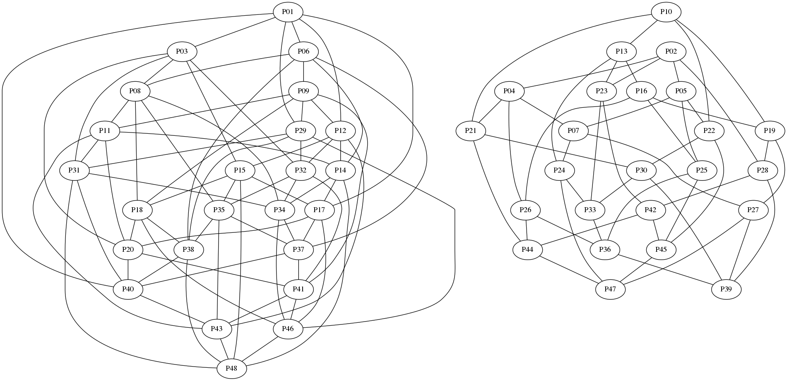
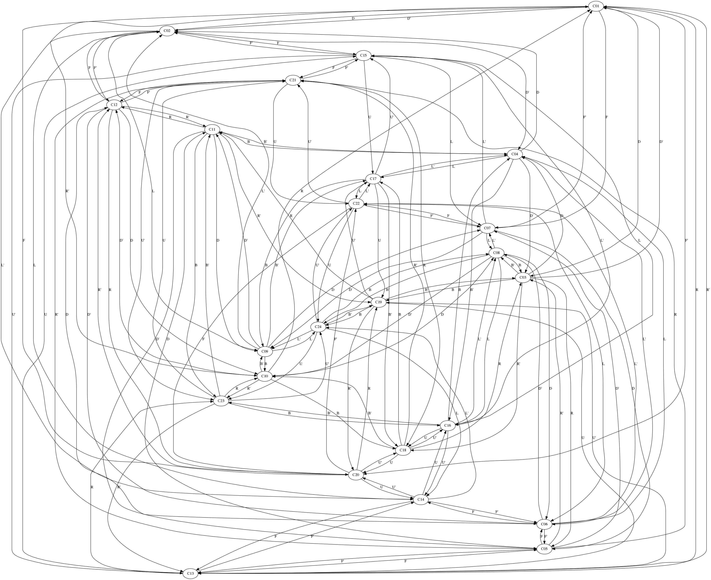
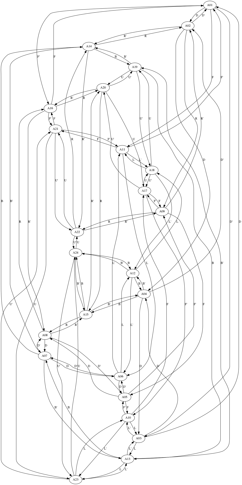

# Conversion des graphes en tables de vérité

Le but de ce script est de générer les tables de vérité des rotations des coins et des arêtes du Rubik's Cube à partir de leur graphe de rotation respectif

Plus précisément il s'agit de générer les tables de vérité permettant déterminer l'emplacement d'arrivée d'une facette de Rubik's Cube à partir de son emplacement de départ et du mouvement utilisé

## Avant de commencer

Déjà il faut observer le graphe des rotations d'un Rubik's Cube



On peut remarquer qu'il y a en fait deux sous-graphe distincts, celui de gauche pour les coins et celui de droite pour les arêtes (plus d'explications sur la [page des graphes](../Graphs/README.md))

On peut en conclure que le traitement à effectuer sur les facettes des coins n'est pas le même que pour les arêtes, c'est la raison pour laquelle il faut générer deux tables de vérité

## Étapes

### Récupérer les données des graphes

Le script va extraire les informations des deux graphes suivants

| Graphe orienté des coins | Graphe orienté des arêtes |
| ------------------------ | ------------------------- |
|  |  |

On récupère ces données depuis les sources des graphes, sur chaque ligne on peut trouver dans cet ordre le numéro de la facette de départ, le numéro de la facette d'arrivée puis le mouvement utilisé

```text
digraph finite_state_machine {
    A01 -> A02 [label="D"];
    A01 -> A03 [label="D'"];
    A01 -> A11 [label="F"];
    A01 -> A16 [label="F'"];

    A02 -> A01 [label="D'"];
    A02 -> A04 [label="D"];
    ...
}
```

Il faut donc récupérer les deux nombres et le code du mouvement, on convertit ensuite le code du mouvement en un nombre

| Code du mouvement | Valeur numérique |
| ----------------- | ---------------- |
| R | 1 |
| R' | 2 |
| U | 3 |
| U' | 4 |
| L | 5 |
| L' | 6 |
| F | 7 |
| F' | 8 |
| D | 9 |
| D' | 10 |
| B | 11 |
| B' | 12 |

Arrivé là on connais tous les cas où un mouvement modifie l'emplacement d'une facette

### Générer toutes les combinaisons de rotation

> C'est bien de savoir ce qui change mais ce n'est que la partie émergée de l'iceberg

Lorsqu'une pièce n'est pas affectée par la rotation d'une face il faut absolument que la valeur retournée soit la valeur de l'emplacement de la pièce, cela représente environ 60 % des cas possibles (1 cas sur 2 pour les coins et 2 cas sur 3 pour les arêtes)

### Générer les tables de vérité à partir de ces combinaisons

Pour chaque table de vérité nous avons une facette et un mouvement en entrée ainsi qu'une facette en sortie. Il y a 24 facettes et 12 mouvements, si on code ces valeurs en binaire il nous faut 5 bits pour les facettes et 4 bits pour les mouvements

| Valeur numérique | Valeur binaire |
| ----------------- | ---------------- |
| 1 | 00001 |
| 2 | 00010 |
| 3 | 00011 |
| 4 | 00100 |
| 5 | 00101 |
| 6 | 00110 |
| 7 | 00111 |
| 8 | 01000 |
| 9 | 01001 |
| 10 | 01010 |
| 11 | 01011 |
| 12 | 01100 |
| 13 | 01101 |
| 14 | 01110 |
| 15 | 01111 |
| 16 | 10000 |
| 17 | 10001 |
| 18 | 10010 |
| 19 | 10011 |
| 20 | 10100 |
| 21 | 10101 |
| 22 | 10110 |
| 23 | 10111 |
| 24 | 11000 |

Ensuite il faut convertir nos valeurs en binaire, on se retrouve donc avec des lignes qui contiennent 14 bits (9 en entrée et 5 en sortie)

```text
| Entrée             | Sortie |
| ------------------ |        |
| Facette | Rotation |        |
|         |          |        |
| 00001   | 0111     | 00111  |
| 00001   | 1000     | 10100  |
| 00001   | 1001     | 00011  |
| 00001   | 1010     | 00010  |
| ...     | ...      | ...    |
```

On se retrouve avec exactement 288 lignes utiles (12×24) sauf qu'une table de vérité doit contenir un nombre de lignes égale à une puissance de 2, il manque donc 224 pour atteindre 512, soit pret de 44 % de chaque table de vérité

Pour signifier que ces lignes ne sont pas à prendre en compte on utilisera des 2 en valeur de sortie

Une fois que les tables de vérité contiennent bien les 512 lignes et que les lignes sont dans l'ordre on se retrouve avec quelque chose qui ressemble plus à ça

```text
| Entrée             | Sortie |
| ------------------ |        |
| Facette | Rotation |        |
|         |          |        |
| 00001   | 1011     | 00001  |
| 00001   | 1100     | 00001  |
| 00001   | 1101     | 22222  |
| 00001   | 1110     | 22222  |
| ...     | ...      | ...    |
```

---

L'étape suivante est bien sûr de simplifier ces tables de vérité, [ça se passe ici](../TruthTableSolver/README.md)
